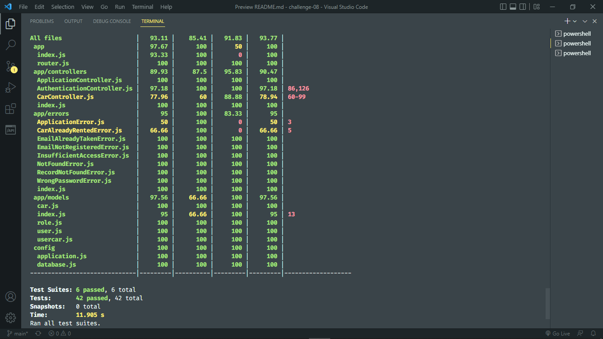
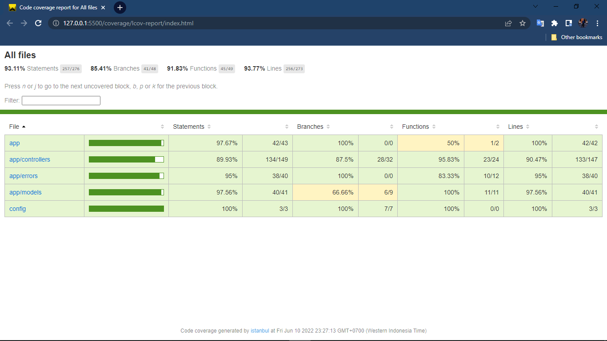

# BCR API

Di dalam repository ini terdapat implementasi API dari Binar Car Rental.
Tugas kalian disini adalah:
1. Fork repository
2. Tulis unit test di dalam repository ini menggunakan `jest`.
3. Coverage minimal 70%

Good luck!

# BINAR FSW5 Challenge-08 Kelompok 2  
 
## Anggota Kelompok  
1. Muhamad Arif Hidayat 
2. Hafid Zaeny 
3. Hana Ghaliyah Azhar
4. Raihan Iqbal 

## Management Database
- `yarn db:create` digunakan untuk membuat database
- `yarn db:drop` digunakan untuk menghapus database
- `yarn db:migrate` digunakan untuk menjalankan database migration
- `yarn db:seed` digunakan untuk melakukan seeding


## Running Server Backend
```sh
yarn start
```

## Running Testing
```sh
yarn test
```

## Coverage Testing



## Deploy Heroku
[https://challenge8-fsw5-kelompok02.herokuapp.com/](https://challenge8-fsw5-kelompok02.herokuapp.com/).


 
